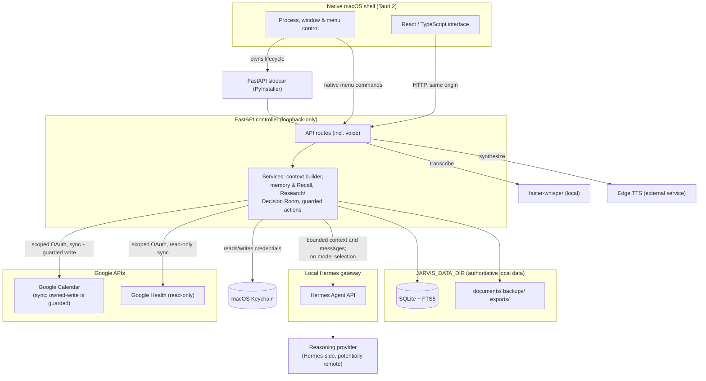
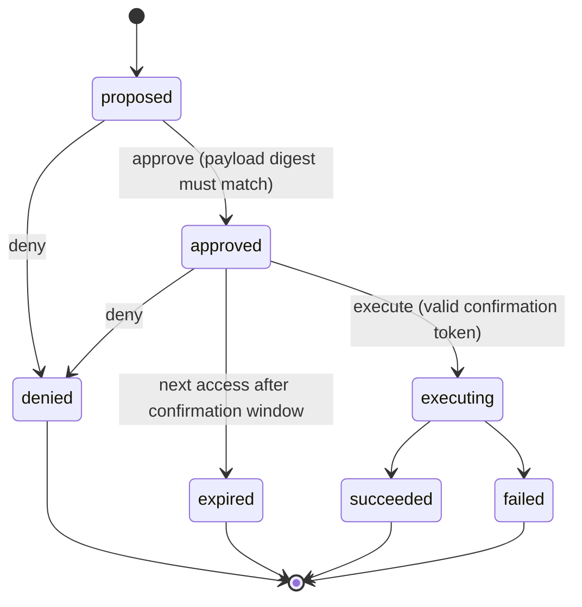

# Jarvis

A native, local-first macOS personal intelligence system whose FastAPI
controller owns persistent memory, deterministic retrieval, structured
workflows, and guarded actions, independent of the configured reasoning
model.

Jarvis divides one personal assistant into six life domains (Body, Mind,
People, Path, Build, Life), each with its own conversation history,
structured records, and long-term memory, all stored in a local SQLite
database under a data directory the app owns — not inside the reasoning
model, and not in any Jarvis-run cloud service.

Jarvis is local-first, not fully offline. It keeps authoritative
persistent state locally and doesn't delegate memory ownership to the
reasoning provider, but features needing model inference, spoken replies,
or Google sync still cross the network through explicit integrations:
bounded context and recent messages go to the local Hermes gateway, which
may forward them to whichever provider is configured; Edge TTS sends
reply text to Microsoft's network service to synthesize speech; Google
Calendar/Health sync talks to Google's own APIs. Raw microphone audio
never leaves the machine — it's transcribed locally by `faster-whisper`
and deleted immediately after.

## Current status

**V1 is feature-complete and frozen.** Every planned phase (local
persistence, export/import/backup, Hermes integration, memory and context,
push-to-talk voice, the animated HUD, permissions and guarded actions,
Google Calendar/Health integrations, Recall/Research/Decision Room, and
native macOS packaging) is implemented and tested. Two manual acceptance
items remain against the installed native app, not the code: a full
VoiceOver pass, and real-viewport inspection at a few fixed window sizes.
Neither blocks normal use. See `docs/ROADMAP.md` for phase history and
`docs/DECISIONS.md` for every non-obvious decision and fix.

Jarvis is packaged as a self-signed macOS app for local use on its own
machine — not notarized, not distributed through the App Store or a
public installer, and not intended for other users.

## What Jarvis demonstrates

This project demonstrates a few things that are easy to claim and harder
to build:

* A persistence layer that survives the AI vendor underneath it: memory,
  records, and conversation history are owned by the controller's own
  database, so switching models needs zero storage or retrieval changes.
* Deterministic retrieval where it matters: search (Recall) is SQLite
  FTS5, not embeddings — a documented, reproducible ranking pipeline
  instead of an unauditable similarity score.
* A real permission boundary between "the user did this" and "the
  assistant proposed this," enforced by an auditable propose-approve-
  execute lifecycle with cryptographic confirmation.
* A dependency-inverted integration to an agent runtime (Hermes): the
  backend never names a model in its own requests — that's Hermes-side
  profile configuration Jarvis's code never touches.

## System architecture



Notes on what the diagram asserts, not just shows:

* React only ever talks to the FastAPI controller over loopback HTTP. It
  never calls Hermes, Google, faster-whisper, or Edge TTS directly; both
  voice endpoints are FastAPI routes.
* Tauri owns native process supervision, window visibility, and menu
  behavior. Native menu commands call FastAPI endpoints; persistent state
  and application logic stay controller-owned, never in Rust.
* The controller assembles context locally, then sends that already-built,
  bounded package to Hermes, which never reaches into Jarvis's database
  and is never given a model name to choose.
* SQLite is authoritative; the FTS5 index is rebuildable from it, never
  the reverse. It's not the only system that ever receives data — Hermes,
  the configured provider, Edge TTS, and Google all see data the
  controller explicitly sends them. Integration services read/write OAuth
  credentials through the Keychain, then call Google's APIs themselves;
  Google never reads the Keychain. Health is read-only; Calendar's limited
  owned-write goes through the guarded action lifecycle below, not sync
  itself.

## Core capabilities

* **Six life domains**, each with its own conversation history, records,
  and long-term memory, plus a domain-less general conversation.
* **Explicit push-to-talk voice.** Hold Space (or a button) to record;
  local `faster-whisper` transcribes on-device, the transcript runs
  through the normal turn flow, and the reply is spoken back through Edge
  TTS, an external service that receives only the reply text. No
  continuous listening, and no raw audio kept after transcription.
* **Model-independent memory.** The controller never sends a model name to
  Hermes and never depends on which model is configured. Every edit
  creates a new version rather than overwriting history; deletion requires
  typing the memory's exact title and always makes a rollback.
* **Structured records** for things that shouldn't live as prose: body
  weights, symptoms, mind check-ins, people interactions, path deadlines,
  build checkpoints, and life tasks, each with its own validated schema.
* **Recall**: deterministic full-text search (SQLite FTS5) across
  conversations, memories, records, summaries, documents, and calendar
  events. No embeddings, no similarity model, no model call at all; domain
  scoping is enforced server-side.
* **Research**: collect evidence found through Recall into a named
  workspace, classify it, and generate a versioned, cited brief. A
  deterministic outline always works with no model call; an optional
  "Draft with Jarvis" pass makes one bounded, tool-free request with every
  citation validated server-side.
* **Decision Room**: weigh a decision against weighted criteria with a
  transparent, auditable score. Jarvis supports the decision; only
  Bernardo's own explicit action marks it decided.
* **Mission Control**: one persisted, timed focus session at a time, plus
  a small watchlist of things pinned by hand, timed from persisted
  timestamps rather than a client-side countdown.
* **A current situational briefing** (NOW/NEXT/WATCH), assembled locally
  with no model call and no mutation, tracking its own state across
  visits so a failed source is reported as failed, not dropped.
* **Google Calendar and Google Health integrations**, using scoped OAuth
  credentials and controller-owned sync. Health is read-only; Calendar
  sync is read/cache, and the limited owned-calendar write goes through
  the guarded action lifecycle below. Credentials live only in Keychain.

See `docs/PRODUCT_SPEC.md` for the full product spec and
`docs/ARCHITECTURE.md` for the technical design behind all of the above.

## Guarded action lifecycle

Anything Jarvis proposes on its own, as opposed to something done directly
through the UI, goes through one auditable lifecycle rather than
executing immediately:



Approval binds to the exact proposal by checking a recomputed SHA-256
digest of its payload, then mints a single-use, five-minute confirmation
token; execution requires that token, consumed on the attempt rather than
on success, scoped to exactly one proposal. The five-minute window is
checked lazily: an approved proposal moves to `expired` the next time it's
read or acted on after the window passes, not via a background timer.
Every transition writes an immutable audit event, and Jarvis never
exposes its own action-execution capabilities to model response text, so
generated text is never treated as authorization.

A proposal left in `executing` by a backend crash is swept at startup and
marked `failed`, never fabricated as `succeeded` — but that status
describes the engine's recovered state, not a confirmed real-world
outcome: an external action such as a Calendar write may already have
completed before the process stopped, so the actual effect is unknown.
The recorded reason says so explicitly, and the user must verify the
external system before retrying, not trust `failed` as proof nothing
happened.

## Local data and the privacy boundary

Application source code lives in this Git repository. **Personal data
never does.** It lives under `JARVIS_DATA_DIR`, which defaults to
`~/JarvisData`:

```
~/JarvisData/
  database/jarvis.sqlite
  documents/
  domain-summaries/
  skills/
  configuration/
  backups/
  exports/
```

* **Deleting this repository must never delete `~/JarvisData`.** They are
  intentionally separate; reinstalling or rebuilding the app never
  overwrites or reinitializes existing data.
* **Export, backup, and restore** are a first-class capability: a portable
  export includes the database, documents, summaries, skills, and
  non-secret configuration, with a manifest and checksums. Restoring
  always validates the archive in isolation first, refuses to overwrite an
  existing installation without explicit confirmation, and takes an
  automatic rollback copy so a failed restore leaves the target unchanged.
  It also forces every integration connection to disconnected and every
  pending action proposal to expired, since credentials and in-flight
  state should never silently reappear elsewhere.
* **API keys and OAuth credentials never enter the export.** They live
  only in the macOS Keychain (Google integrations) or Hermes's own
  profile-scoped secret storage (the reasoning provider), never in SQLite,
  logs, or an unencrypted archive.
* **MIND and PEOPLE data is structurally excluded** from the home
  briefing and Recall's default search scope, regardless of any settings
  flag, because the code paths that would read those tables simply don't
  exist.

## Native application behavior

Jarvis ships as a real native macOS app (Tauri 2 shell around the same
React frontend, loading it same-origin from the local FastAPI backend).
The shell owns process supervision plus native window and menu behavior.
Menu actions delegate to FastAPI rather than implementing data or
integration logic in Rust. On launch it probes the backend's health
endpoint, reuses an already-running backend if one responds, and
otherwise spawns and owns one, draining its output so the child never
deadlocks. Quitting sends SIGTERM to a backend it started itself (SIGKILL
only if needed) and never touches one it didn't spawn. Closing the window
hides the app instead of quitting it, so scheduled syncs keep running;
the Dock icon or menu bar brings it back.

The app bundle is application code only, never a second source of truth
for where personal data lives. It's signed with a self-signed certificate
that exists only on the build machine, for trust continuity across
rebuilds, not for distribution.

## Quick Start

**Prerequisites**: Python 3.12+, [uv](https://docs.astral.sh/uv/)
(`brew install uv`), Node.js 20+ and npm.

```bash
# From the repository root
cd backend
uv sync --group dev
uv run alembic upgrade head
uv run uvicorn app.main:app --reload --host 127.0.0.1 --port 8000
```

In a second terminal, from the repository root:

```bash
cd frontend
npm install
npm run dev   # http://localhost:5173
```

Run the verification commands from the repository root:

```bash
(cd backend && uv run pytest)
(cd frontend && npm run test)
(cd frontend && npm run typecheck && npm run build)
```

For combined development or day-to-day launch/recovery:

```bash
./scripts/dev.sh
./scripts/jarvisctl.sh open
./scripts/jarvisctl.sh status
./scripts/jarvisctl.sh stop
```

Jarvis talks to whatever model a dedicated local Hermes Agent profile is
configured for; the backend never names a model in its own requests.
Hermes setup, hardening, and Google OAuth configuration are kept out of
this README on purpose; see `docs/ARCHITECTURE.md` §§7-8, §14, and §24
(native `.app` build/install), plus `docs/DECISIONS.md`.

## Verification and current limitations

* Backend/frontend test suites, type-checking, and a production frontend
  build all pass as part of the phase-completion process in
  `docs/ROADMAP.md`.
* A full axe-core (WCAG2 A/AA) accessibility sweep reports zero known
  violations across every screen and diagnostic state.
* A live restoration drill (two isolated data directories, data populated
  across every subsystem reachable without Hermes/OAuth) confirmed a real
  export/validate/restore round trip preserves data correctly.
* Switching the reasoning provider needs no Jarvis code changes, by
  construction; exercised once (Claude to GPT-5.6 Terra via Hermes), not
  against every provider.
* Outstanding: a full VoiceOver pass and real-viewport inspection at a
  few fixed sizes, blocked on manual acceptance, not any known code issue.

## Explicitly out of scope

Automatic memory extraction from conversation, embedding-based retrieval,
a custom wake word or always-listening microphone mode, autonomous
sub-agents, email/Telegram/Discord messaging, smart-home control,
arbitrary filesystem access, browser automation, terminal/code execution,
and any Google Health write capability. See `docs/ROADMAP.md` for what's
deferred and why.

## Further documentation

* `CLAUDE.md`: full project profile and durable engineering rules.
* `docs/PRODUCT_SPEC.md`: the product spec.
* `docs/ARCHITECTURE.md`: how the implementation actually works.
* `docs/ROADMAP.md`: phase-by-phase status.
* `docs/DECISIONS.md`: an append-only decision and bug-fix log.
* `docs/DESIGN_DIRECTION.md`: the visual design brief.
