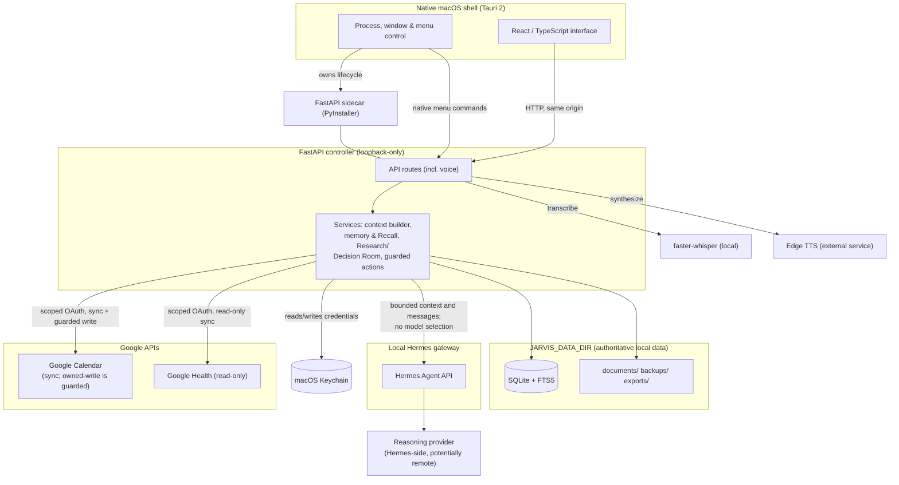
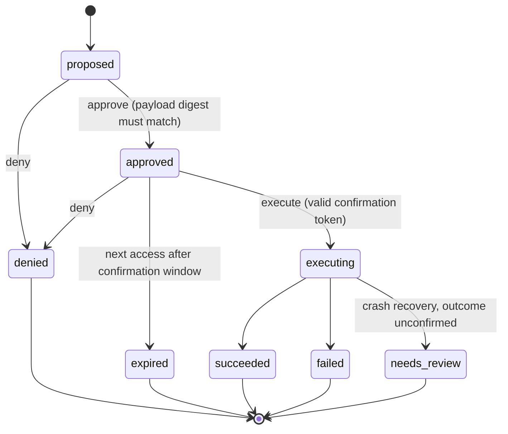

# Jarvis

Jarvis is a local-first personal intelligence system for macOS. It is
built on a Python (FastAPI and SQLite) controller, a React/TypeScript
interface, and a Tauri 2 native shell. It organizes one assistant into
six life domains (Body, Mind, People, Path, Build, Life), and its
controller, not the configured AI provider, owns memory, structured
records, retrieval, and workflow state.

Jarvis is local-first, not fully offline. Persistent memory and
application state stay in a local SQLite database under a data directory
the app owns. Raw microphone audio is transcribed locally with
`faster-whisper` and deleted right after. Bounded conversation context can
still cross the network for a few explicit purposes: it passes through a
local Hermes gateway to whichever reasoning provider is configured, reply
text goes to Edge TTS for speech synthesis, and Google Calendar/Health
integrations call Google's own APIs. Credentials for all of that live in
macOS Keychain or Hermes-managed secret storage, never in the repository
or an export.

## Current status

V1 is feature-complete; additional product scope is intentionally
deferred. Every planned phase (local persistence, export/import/backup,
Hermes integration, memory and context, push-to-talk voice, the animated
HUD, permissions and guarded actions, Google Calendar/Health
integrations, Recall/Research/Decision Room, and native macOS packaging)
is implemented and tested:

* **981 backend tests passing**, **469 frontend tests passing**.
* TypeScript type-check clean and the production frontend build succeeds.
* Backend Ruff is clean for the files touched during hardening work (not
  asserted repository-wide).
* Frontend lint has only pre-existing, documented warnings, not new
  failures.
* Google Calendar crash-recovery behavior is verified with mocks and
  fakes (including `httpx.MockTransport`), never against a live Google
  account.

Two manual acceptance items remain against the installed native app, not
the code: a full VoiceOver pass, and real-viewport inspection at a few
fixed window sizes. Neither blocks normal use. See `docs/ROADMAP.md` for
phase history and `docs/DECISIONS.md` for every non-obvious decision and
fix.

Jarvis is packaged as a self-signed macOS app for local use on its own
machine, not notarized, not distributed through the App Store or a public
installer, and not intended for other users.

## Engineering highlights

* **Controller-owned, provider-decoupled persistence**: memory, records,
  and conversation history live in the controller's own SQLite database,
  so switching the configured reasoning model needs zero storage or
  retrieval changes.
* **Deterministic retrieval**: Recall search runs on SQLite FTS5, not
  embeddings, a documented and reproducible ranking pipeline instead of
  an unauditable similarity score.
* **Structured, versioned workflows**: domain records, memories, and
  Research/Decision Room briefs are typed and versioned, never
  overwritten prose.
* **Guarded propose/approve/execute actions**: anything Jarvis proposes on
  its own is bound to a payload digest and a single-use confirmation
  token before it ever executes.
* **Crash-safe Calendar recovery**: an interrupted Google Calendar write
  is reconciled against Google's own state using a deterministic event ID
  rather than guessed at.

## System architecture


```mermaid
flowchart TB
    subgraph shell["Native macOS shell (Tauri 2)"]
        SUP["Process, window & menu control"]
        UI["React / TypeScript interface"]
    end

    SIDECAR["FastAPI sidecar (PyInstaller)"]

    subgraph backend["FastAPI controller (loopback-only)"]
        API["API routes (incl. voice)"]
        SVC["Services: context builder,\nmemory & Recall, Research/\nDecision Room, guarded actions"]
        API --> SVC
    end

    subgraph data["JARVIS_DATA_DIR (authoritative local data)"]
        DB[("SQLite + FTS5")]
        DOCS["documents/ backups/ exports/"]
    end

    STT["faster-whisper (local)"]
    TTS["Edge TTS (external service)"]

    subgraph gateway["Local Hermes gateway"]
        HERMES["Hermes Agent API"]
    end

    PROVIDER["Reasoning provider\n(Hermes-side, potentially remote)"]

    KEYCHAIN[("macOS Keychain")]

    subgraph integrations["Google APIs"]
        CAL["Google Calendar\n(sync; owned-write is guarded)"]
        HEALTH["Google Health (read-only)"]
    end

    SUP -->|owns lifecycle| SIDECAR
    SIDECAR --- API
    SUP -->|native menu commands| API
    UI -->|HTTP, same origin| API
    SVC --> DB
    SVC --> DOCS
    API -->|transcribe| STT
    API -->|synthesize| TTS
    SVC -->|bounded context and messages;\nno model selection| HERMES
    HERMES --> PROVIDER
    SVC -->|reads/writes credentials| KEYCHAIN
    SVC -->|scoped OAuth, sync + guarded write| CAL
    SVC -->|scoped OAuth, read-only sync| HEALTH
```

Notes on what the diagram asserts, not just shows:

* React only ever talks to the FastAPI controller over loopback HTTP. It
  never calls Hermes, Google, faster-whisper, or Edge TTS directly.
* Tauri owns native process supervision, window visibility, and menu
  behavior; persistent state and application logic stay
  controller-owned, never in Rust.
* The controller assembles context locally, then sends only that already
  built, bounded package to Hermes, which never reaches into Jarvis's
  database and is never given a model name to choose.
* SQLite is authoritative; the FTS5 index is rebuildable from it, never
  the reverse. Integration services read OAuth credentials from the
  Keychain, then call Google's APIs themselves; Google never reads the
  Keychain. Health is read-only; Calendar's limited owned-write goes
  through the guarded action lifecycle below, not sync itself.

## Core capabilities

* **Six life domains**, each with its own conversation history, records,
  and long-term memory, plus a domain-less general conversation.
* **Push-to-talk voice**, not continuous listening: hold Space to record,
  local `faster-whisper` transcribes on-device, and the reply is spoken
  back through Edge TTS. No raw audio is kept after transcription.
* **Versioned memory**: edits create a new version rather than
  overwriting history; deletion requires typing the memory's exact title
  and always leaves a rollback.
* **Structured records** for things that shouldn't live as prose: body
  weights, symptoms, mind check-ins, people interactions, path deadlines,
  build checkpoints, and life tasks, each with its own validated schema.
* **Recall**: deterministic full-text search (SQLite FTS5), not
  embeddings, across conversations, memories, records, summaries,
  documents, and calendar events, with domain scoping enforced
  server-side.
* **Research**: collect evidence found through Recall into a named
  workspace and generate a versioned, cited brief. A deterministic
  outline needs no model call; an optional "Draft with Jarvis" pass makes
  one bounded, tool-free request with every citation validated
  server-side.
* **Decision Room**: weigh a decision against weighted criteria with a
  transparent, auditable score. Jarvis supports the decision; only
  Bernardo's own explicit action marks it decided.
* **Mission Control**: one persisted, timed focus session at a time, plus
  a small watchlist of things pinned by hand, timed from persisted
  timestamps rather than a client-side countdown.
* **A current situational briefing** (NOW/NEXT/WATCH), assembled locally
  with no model call and no mutation, tracking its own state across
  visits so a failed source is reported as failed, not dropped.
* **Google Calendar and Google Health integrations**, using scoped OAuth
  credentials. Health is read-only; Calendar's limited owned-write goes
  through the guarded action lifecycle below.

See `docs/PRODUCT_SPEC.md` for the full product spec and
`docs/ARCHITECTURE.md` for the technical design behind all of the above.

## Guarded action lifecycle

Anything Jarvis proposes on its own, as opposed to something done directly
through the UI, goes through one auditable lifecycle rather than
executing immediately:


```mermaid
stateDiagram-v2
    [*] --> proposed
    proposed --> approved: approve (payload digest must match)
    proposed --> denied: deny
    approved --> denied: deny
    approved --> executing: execute (valid confirmation token)
    approved --> expired: next access after confirmation window
    executing --> succeeded
    executing --> failed
    executing --> needs_review: crash recovery, outcome unconfirmed
    denied --> [*]
    expired --> [*]
    succeeded --> [*]
    failed --> [*]
    needs_review --> [*]
```

Approval is bound to the exact proposal payload: approving recomputes a
SHA-256 digest of the payload and checks it matches, then mints a
single-use, five-minute confirmation token. Execution requires that
token and consumes it on the attempt, not on success. This is
payload-bound confirmation, not cryptographic identity authentication.
The five-minute window is checked lazily, on the next read or action
after it passes, rather than by a background timer.

A proposal left `executing` by a backend crash is reconciled at startup
rather than blindly marked `failed`. A purely local action (memory,
structured records, domain summaries) has no effect outside Jarvis's own
database transaction, so an interrupted one genuinely never happened and
`failed` is accurate. A Google Calendar write is different: its effect
lives in Google, outside that transaction, so recovery asks Google
directly instead of guessing.

Every Calendar create sends a deterministic, Google-compatible event ID
derived from the proposal's own persisted ID, plus an
`extendedProperties.private.jarvis_action_id` tag, so a repeated create
after an unconfirmed write gets an already-exists conflict from Google
rather than a duplicate event. On that conflict Jarvis fetches the
existing event and verifies it belongs to the same proposal (via the ID
or, for events created before this scheme existed, the private-property
tag) before treating the action as successful. If Google confirms the
event genuinely does not exist, the proposal returns to `approved` with a
fresh token so it can be retried. When the outcome cannot be determined,
the proposal is left `needs_review`: it appears in the Actions Centre
with a plain explanation, offers no approve, deny, execute, or retry
control, and stays that way until the calendar is checked directly. This
is duplicate-resistant within Google Calendar's supported semantics, not
a guarantee of exactly-once execution, and has been tested only against
mocked and faked Google responses, never a live account.

## Local data and the privacy boundary

Application source code lives in this Git repository. **Personal data
never does.** It lives under `JARVIS_DATA_DIR`, which defaults to
`~/JarvisData`:

```
~/JarvisData/
  database/jarvis.sqlite
  documents/
  domain-summaries/
  skills/
  configuration/
  backups/
  exports/
```

* **Deleting this repository must never delete `~/JarvisData`.** They are
  intentionally separate; reinstalling or rebuilding the app never
  overwrites or reinitializes existing data.
* **Export, backup, and restore** are a first-class capability: a portable
  export includes the database, documents, summaries, skills, and
  non-secret configuration, with a manifest and checksums. Restoring
  always validates the archive first, refuses to overwrite an existing
  installation without explicit confirmation, and takes an automatic
  rollback copy so a failed restore leaves the target unchanged. It also
  forces every integration to disconnected and every pending action
  proposal to expired, since credentials and in-flight state should never
  silently reappear elsewhere.
* **Credentials never enter the export**; they stay in Keychain or
  Hermes-managed secret storage, as described above.
* **MIND and PEOPLE data is structurally excluded** from the home
  briefing and Recall's default search scope, regardless of any settings
  flag, because the code paths that would read those tables simply don't
  exist.

## Native application behavior

Jarvis ships as a real native macOS app (Tauri 2 shell around the same
React frontend, loading it same-origin from the local FastAPI backend).
The shell owns process supervision plus native window, Dock, and menu
behavior; application state and business logic stay in FastAPI and
SQLite, never in Rust. On launch it reuses an already-healthy backend if
one responds, or spawns and owns one otherwise, and it only ever
terminates a backend process it started itself. Closing the window hides
the app instead of quitting it, so scheduled syncs keep running; the Dock
icon or menu bar brings it back.

The app bundle is application code only, never a second source of truth
for where personal data lives. It's signed with a self-signed certificate
that exists only on the build machine, for trust continuity across
rebuilds, not for distribution.

## Quick Start

**Prerequisites**: Python 3.12+, [uv](https://docs.astral.sh/uv/)
(`brew install uv`), Node.js 20+ and npm.

```bash
# From the repository root
cd backend
uv sync --group dev
uv run alembic upgrade head
uv run uvicorn app.main:app --reload --host 127.0.0.1 --port 8000
```

In a second terminal, from the repository root:

```bash
cd frontend
npm install
npm run dev   # http://localhost:5173
```

Run the verification commands from the repository root:

```bash
(cd backend && uv run pytest)
(cd frontend && npm run test)
(cd frontend && npm run typecheck && npm run build)
```

For combined development or day-to-day launch/recovery:

```bash
./scripts/dev.sh
./scripts/jarvisctl.sh open
./scripts/jarvisctl.sh status
./scripts/jarvisctl.sh stop
```

Jarvis talks to whatever model a dedicated local Hermes Agent profile is
configured for; the backend never names a model in its own requests.
Hermes setup, hardening, and Google OAuth configuration are kept out of
this README on purpose; see `docs/ARCHITECTURE.md` §§7-8, §14, and §24
(native `.app` build/install), plus `docs/DECISIONS.md`.

## Verification and current limitations

* Backend/frontend test suites, type-checking, and a production frontend
  build all pass as part of the phase-completion process in
  `docs/ROADMAP.md`.
* A full axe-core (WCAG2 A/AA) accessibility sweep reports zero known
  violations across every screen and diagnostic state. This is automated
  scanning, not a substitute for a manual VoiceOver pass, keyboard-only
  inspection, or real-viewport visual review.
* A live restoration drill (two isolated data directories, data populated
  across every subsystem reachable without Hermes/OAuth) confirmed a real
  export/validate/restore round trip preserves data correctly.
* Switching the reasoning provider needs no Jarvis code changes, by
  construction; exercised once (Claude to GPT-5.6 Terra via Hermes), not
  against every provider.
* Outstanding: a full VoiceOver pass and real-viewport inspection at a
  few fixed sizes, blocked on manual acceptance, not any known code issue.

## Explicitly out of scope

Automatic memory extraction from conversation, embedding-based retrieval,
a custom wake word or always-listening microphone mode, autonomous
sub-agents, email/Telegram/Discord messaging, smart-home control,
arbitrary filesystem access, browser automation, terminal/code execution,
and any Google Health write capability. See `docs/ROADMAP.md` for what's
deferred and why.

## Further documentation

* `CLAUDE.md`: full project profile and durable engineering rules.
* `docs/PRODUCT_SPEC.md`: the product spec.
* `docs/ARCHITECTURE.md`: how the implementation actually works.
* `docs/ROADMAP.md`: phase-by-phase status.
* `docs/DECISIONS.md`: an append-only decision and bug-fix log.
* `docs/DESIGN_DIRECTION.md`: the visual design brief.
